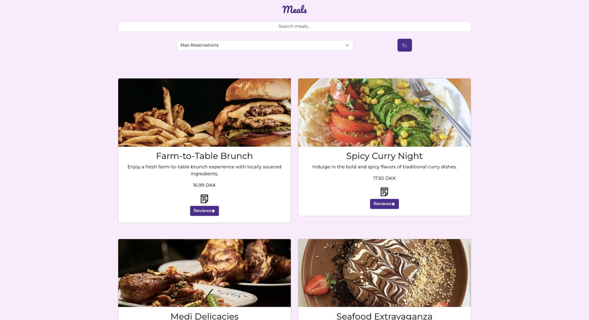

  

<h3 align="center">Welcome to Meal Sharing App</h3>

---

 
  This is a meal sharing app where people can come together to share and enjoy delicious meals. Whether you're a seasoned chef or simply enjoy trying new dishes, Meal Sharing App provides a platform to connect with fellow food enthusiasts and discover culinary delights from around the world.
    

## ⛏️ Built Using 

- [MySQL](https://www.npmjs.com/package/mysql) - Database
- [Express](https://expressjs.com/) - Server Framework
- [Node.js](https://nodejs.org/en/) - Server Environment
- [React](https://reactjs.org/) - Frontend Library
- JavaScript - Programming Language
- [PostgreSQL](https://www.postgresql.org/) - Additional Database
- API Development and Testing with Postman
- Deployment on [Render](https://render.com/)

## ✍️ Authors 

- [Samima Hassan] - [GitHub Profile](https://github.com/samima55)

## 📹 Demo
[Link to Demo Video]

<!-- You can add more sections as needed, such as Features, Installation, Usage, Contributing, License, etc. -->
